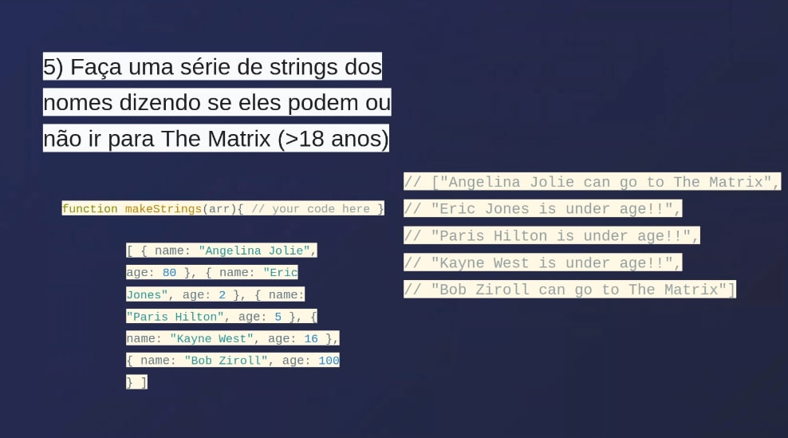
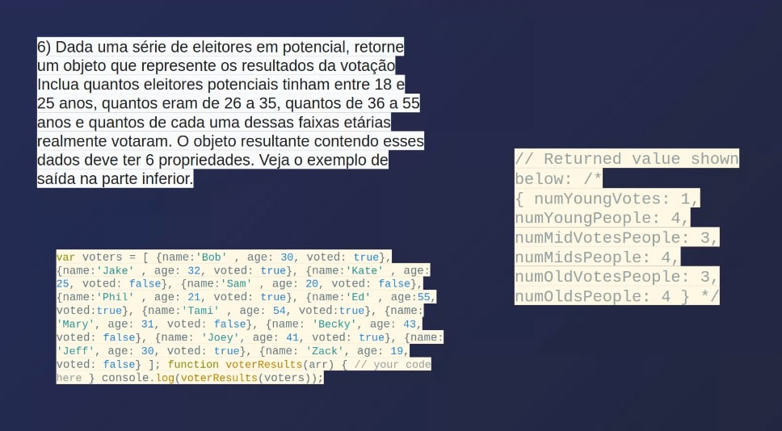

# santander-coders-module2-challenge
Exercícios de conclusão do segundo modulo do Curso Santander Coders da Let's Code

Exercício 1:

Exercício 2:

Exercício 3:

Criar um módulo calculadora com as operações de adição, multiplicação, subtração, divisão, uma função reset e uma função para listar o histórico de operações.